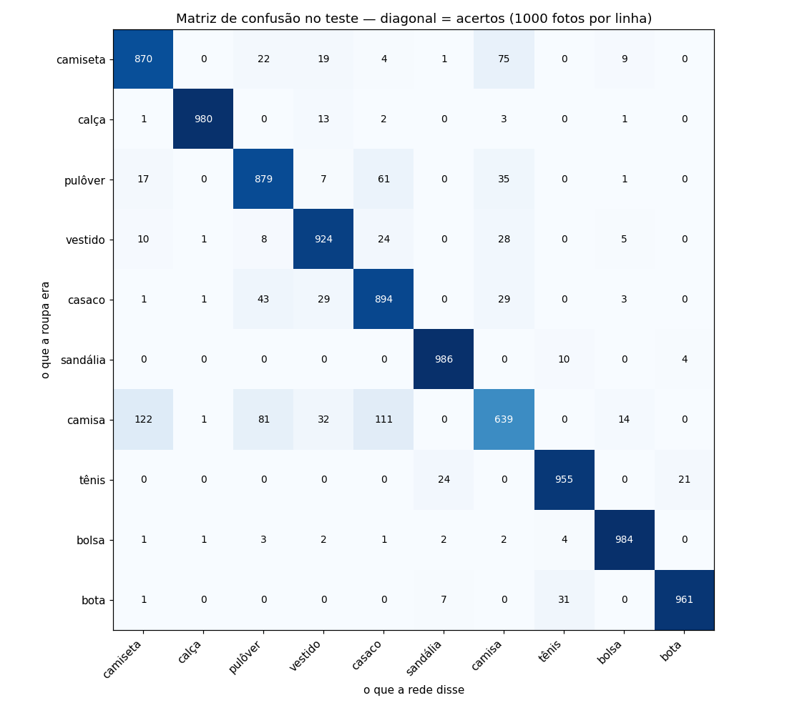

# Resultados

Os números medidos em cada passo, com o que eles querem dizer. Os arquivos brutos ficam
em `training/runs/` (fora do git); aqui fica o registro.

Para reproduzir, com a semente 42:

```bash
training/.venv/bin/python -m training.src.baseline   # passo 2, ~20 s
training/.venv/bin/python -m training.src.treino     # passo 3, ~2 min (rode num terminal, não pelo `!`)
```

---

## Spec 0001 — Fashion-MNIST (2026-09-16)

### A prova: 10 000 fotos que nenhum modelo viu

| Modelo | Acurácia no teste | O que é |
|---|---|---|
| Classe majoritária | **10,00%** | Chuta "tênis" em tudo, sem olhar a foto |
| Regressão logística | **84,10%** | Uma camada: um peso por pixel, sem enxergar formato |
| **Rede convolucional** | **90,72%** | Enxerga formato. **+6,62 pontos sobre a logística** |

Meta da spec: ≥ 88% e acima da logística. **Batida.**

### Como o treino da rede evoluiu

| Época | `accuracy` (estudo) | `val_accuracy` (validação) |
|---|---|---|
| 1 | 77,8% | 85,8% ← já passa a logística depois de 10 épocas (85,3%) |
| 5 | 89,7% | 90,2% |
| 10 | 92,5% | 91,5% |

Estudo e validação ficaram a 1 ponto um do outro: a rede **não decorou**. Nas primeiras
épocas a validação fica acima do estudo por causa do `Dropout`, que atrapalha a rede de
propósito só durante o treino.

### Acerto por roupa (recall)



| Roupa | Acerto | | Roupa | Acerto |
|---|---|---|---|---|
| sandália | 98,6% | | vestido | 92,4% |
| bolsa | 98,4% | | casaco | 89,4% |
| calça | 98,0% | | pulôver | 87,9% |
| bota | 96,1% | | camiseta | 87,0% |
| tênis | 95,5% | | **camisa** | **63,9%** |

**Os erros mais comuns:** camisa → camiseta (122×), camisa → casaco (111×),
camisa → pulôver (81×), camiseta → camisa (75×), pulôver → casaco (61×).

### O que isso ensina

- **Os erros ficam dentro da família.** Roupa de cima é confundida com roupa de cima, e
  calçado com calçado (bota → tênis 31×). Calça nunca virou bota. A rede aprendeu
  formato; o que falta é o detalhe fino, em 28×28 pixels, que separa camisa de camiseta.
- **A camisa é difícil até para gente.** Veja a linha "camisa" em
  [`resultados/0001-fotos.png`](resultados/0001-fotos.png): há camisas de manga comprida
  que parecem pulôver.
- **Não se melhora a camisa agora.** Os 63,9% vieram da prova. Mudar a rede para subir
  esse número e rodar a prova de novo é estudar pela prova. A spec encerra o assunto ao
  bater o piso; melhorar a rede é a etapa 4, olhando só a validação.

### Critérios de aceite cobertos até aqui

| CA | Resultado | Onde |
|---|---|---|
| CA-01 | Splits 54 000 / 6 000 / 10 000, zero imagens repetidas entre montes | `tests/test_dados.py` |
| CA-02 | Classe majoritária: 10,00% | `baseline.py` + `tests/test_baseline.py` |
| CA-03 | Regressão logística: 84,10% | `baseline.py` + `tests/test_baseline.py` |
| CA-04 | Rede: 90,72% (≥ 88% e acima da logística) | `treino.py` |
| CA-09 | Duas rodadas com semente 42: 0 respostas diferentes | `tests/test_treino.py` |
| CA-10 | Menor recall: camisa, 63,9% (nenhum zero) | `treino.py` |

Faltam CA-05 a CA-08: exportar para `.tflite` e verificar a compressão (passos 4 e 5).
